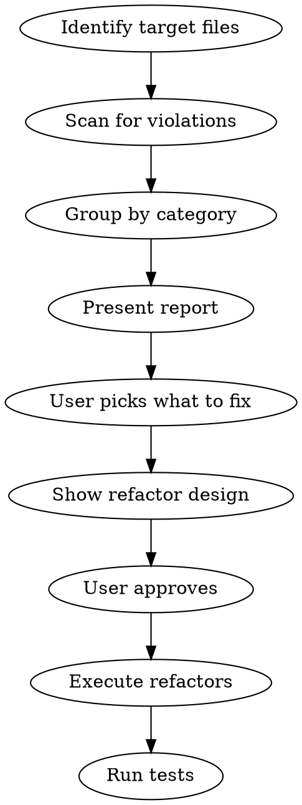

# Python Code Review & Refactor

On-demand review of existing Python code using same guidelines as the `python-code` skill.

## Usage

- `/python-review` — review all changed Python files (git diff)
- `/python-review <path>` — review specific file or directory
- `/python-review all` — review entire `hexwar/` package

## Process



### Step 1: Scan

Read target files and check against each category:

**Readability**
- Methods doing multiple things (should be split)
- Deep nesting (4+ levels)
- Unclear or misleading names
- Silent failures (validation returns empty with no signal)
- Dead code, unused imports, commented-out code

**Type Safety**
- Magic strings used as enums (`"declaration"`, `"resolution"`)
- Dict-as-struct patterns (dict with known schema should be dataclass/TypedDict)
- Missing type annotations on public functions
- Raw `str` where domain alias exists (`UnitId`, `Player`)

**Structure**
- God classes (single class doing too many things)
- Files covering multiple unrelated concepts
- Leaky abstractions (client accessing system internals, private method calls across layers)
- Duplicated code blocks (80%+ similar structure)
- Circular or wrong-direction imports

**Cleanup**
- Unused functions, variables, imports
- Legacy artifacts from removed features
- Dead assignments (`self.x = self.x`)

### Step 2: Report

Present violations grouped by category. For each violation:
- File and line reference
- What the violation is
- Severity: **high** (actively misleading or buggy), **medium** (hurts readability), **low** (minor cleanup)

Example format:
```
## Readability (3 issues)

1. **HIGH** test_system.py:543 — `_legal_declare_actions` is 95 lines with 5 levels of nesting.
   Propose: split into `_find_available_attackers`, `_generate_fan_in_actions`, `_generate_fan_out_actions`.

2. **MEDIUM** pygame_client.py:153 — `_get_phase_handler` returns lambda but caller ignores return value.
   Propose: call handler directly instead of returning it.

3. **LOW** engine.py:88 — dead assignment `self._state = self._state`.
   Propose: remove line.
```

### Step 3: Refactor

After user picks which items to fix:

1. Show design for each refactor (function signatures, what moves where)
2. Wait for approval
3. Execute changes
4. Run `python -m pytest tests/ -v` to verify nothing broke

**Batch small fixes** (unused imports, dead code) into one pass. **Design individually** for structural changes (class extraction, method splitting).

## What This Does NOT Do

- Add new features
- Change behavior or logic
- Rewrite from scratch
- Touch files user didn't ask about (unless `all` mode)

Pure quality improvement — same behavior, better code.
