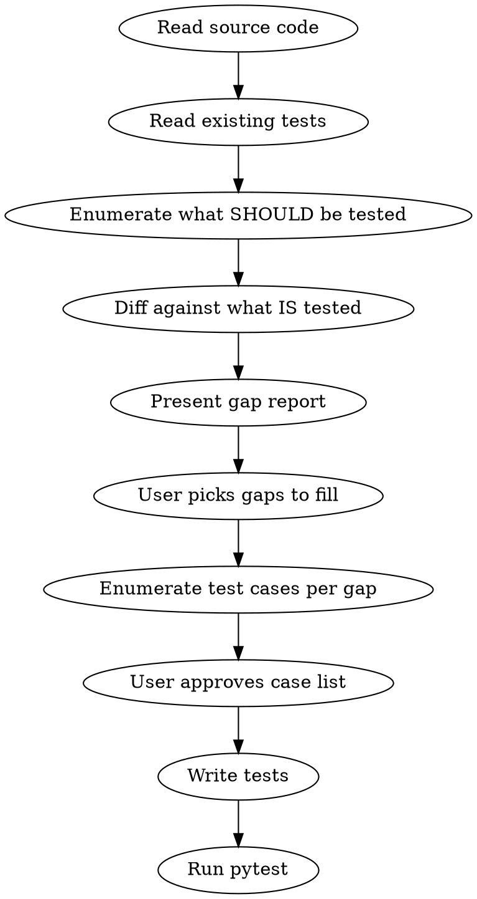

# Test Coverage Gap Analysis

Find untested scenarios and fill gaps. Uses same guidelines as `python-tests` skill.

## Usage

- `/test-gaps` — scan all source files against all test files
- `/test-gaps <path>` — scan specific source file or module

## Process



### Step 1: Analyze Source

For each source file/module, identify:
- Public functions and methods
- Code branches (if/else, match, guard clauses)
- State transitions (phase changes, unit modifications)
- Error conditions (validation, illegal actions)
- Mechanic interactions (what combines with what)

### Step 2: Analyze Existing Tests

Map existing tests to source features:
- Which functions/mechanics have tests?
- Which scenarios are covered?
- Which edge cases are tested?
- Which error paths are tested?

### Step 3: Gap Report

Present gaps grouped by source file. For each gap:
- What mechanic/function is untested
- What category: happy path, edge case, error path, interaction
- Priority: **high** (core mechanic untested), **medium** (edge case missing), **low** (minor path)

Example format:
```
## test_system.py — Combat Resolution (4 gaps)

1. **HIGH** `_resolve_battle` — no test for defender-wins outcome
2. **HIGH** `_resolve_battle` — no test for mutual destruction
3. **MEDIUM** `_apply_combat_result` — unit at strength=1 destroyed vs retreated
4. **LOW** `_legal_declare_actions` — fan-out with all targets already declared

## engine.py — Phase Management (2 gaps)

1. **MEDIUM** `advance_phase` — wrapping past last phase to new turn
2. **LOW** `undo` — undo when no actions taken
```

### Step 4: Write Tests

After user picks which gaps to fill:

1. Enumerate specific test cases for each gap (per `python-tests` skill)
2. Present case list for approval
3. Write tests using full engine pipeline
4. Run `python -m pytest tests/ -v` to verify all pass

Place tests in existing test file for that module, or create new file
if no test file exists for the source module.
